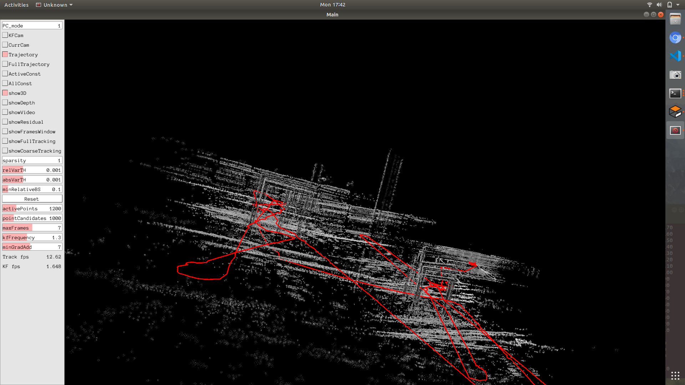
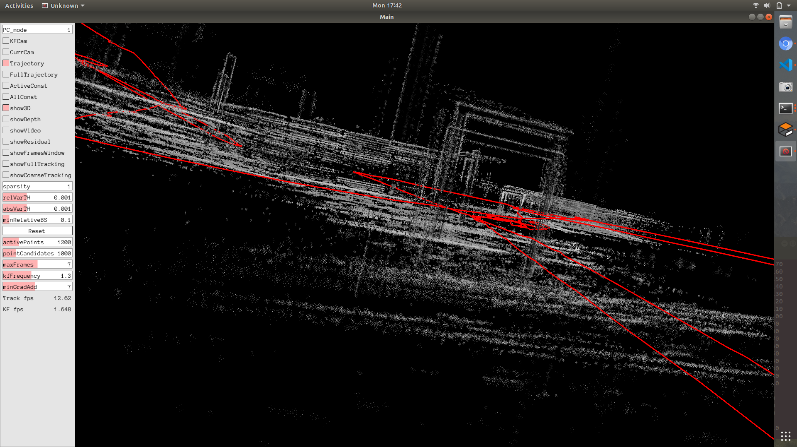
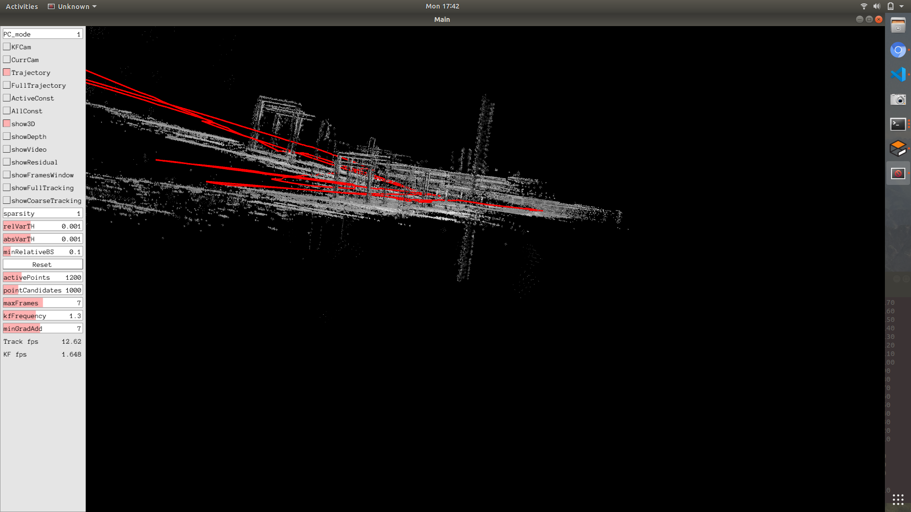

# DSO Test 1

The AUV_v2 vehicle was made to traverse from one end of the pool to other end multiple times while going through the gate. The *red* path indicates the path traversed. 

## Observations
1. The gate was detected at multiple places when viewed from different points of view.

2. While traversing towards the gate along the line of same point of view, the point cloud shows the height of the gate is suddenly increased. This could also be a result of not so accurate estimation of location.

3. The long point cloud visible in the following image is actually the obstacle. 

4. DSO is able to detect SYS motion properly. Still the heave issue needs to be solved.

More observation images are present in the `multimedia` folder.

## Inferences
1. DSO can be used to calculate approximate displacement for short distances. But it must be updated with a map.
2. Must only use DSO for localization. This is because for mapping, the back-end needs to be developed.

## Next step
Run DSO with underwater filter and observe the results.

[Back to Home](./Home.md)