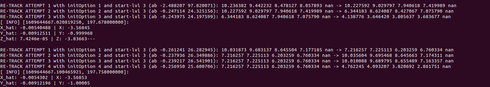
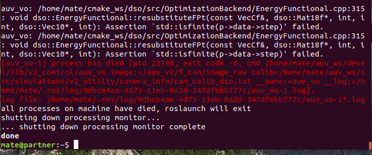
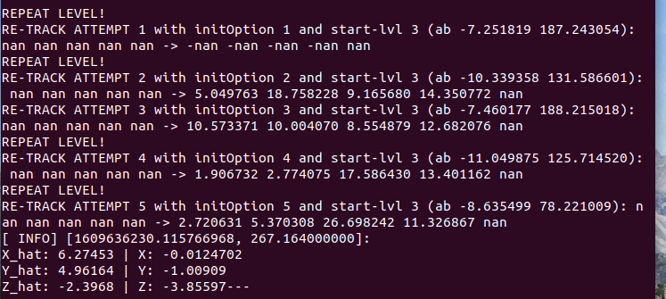

# DSO Test 2

## Prerequisite
Attempt was made to execute DSO with underwater filter, but such a filter was not readily available online. Instead of that, another texture resembling the sunlight at the bottom of the swimming, is added. The new floor texture would be referred to as *sunlight texture* (representative of a lower textured environment) and the previous floor as *regular texture* (representative of a higher textured environment).

## Observations
1. While executing the custom output wrapper for DSO, with the regular texture, the following output was observed whenever the vehicle was rotated (yaw) without translating. 

This highlights the comment that was mentioned in the README of *dso* repo:
> DSO cannot do magic: if you rotate the camera too much without translation, it will fail. Since it is a pure visual odometry, it cannot recover by re-localizing, or track through strong rotations by using previously triangulated geometry.... everything that leaves the field of view is marginalized immediately.
The above *fail* was observed numerous times while performing test runs.

2. On running the same custom output wrapper with the sunlight texture, the following types of errors were recurring even when translation was performed with rotation:

3. The test runs with regular texture were more robust with the *fail* than the sunlight texture.
4. On rotating the vehicle at very high speed, the *fail* occurred even with regular texture. (Apart from this, the vehicle's PID becomes unstable and the vehicle does not stop. Need to resolve this issue)
5. The estimated `x, y, z` and the rate at which the were changing for the same ground truth rate in both the textured differed by a very very large amount.

### Summary
| Parameter | Regular Texture | Sunlight Texture |
| --- | --- | --- |
| **Texture type** | Highly textured | Low textured |
| **Fail condition frequency** | Low | High |
| **Rate of change of position**   **when compared to ground**   **truth rate of change of position** | Approximately same | Lower |
| **Estimate position values**  | Large | Small |

## Inferences
1. DSO does work with lower textured environments but the vehicle must be manoeuvred such that the frequency of *fail* occurrence is as low as possible. This means the vehicle must translate while rotating or else the probability of *fail* case would be higher.
2. The frequency of *fail* would increase with the decrease in visibility.
3. The estimated position and the rate at which it changes is highly dependent on the texture of the environment.

## Next step
Discuss the results with the team, learn about their progress, and then decide what to do next.

[Back to Home](./Home.md)