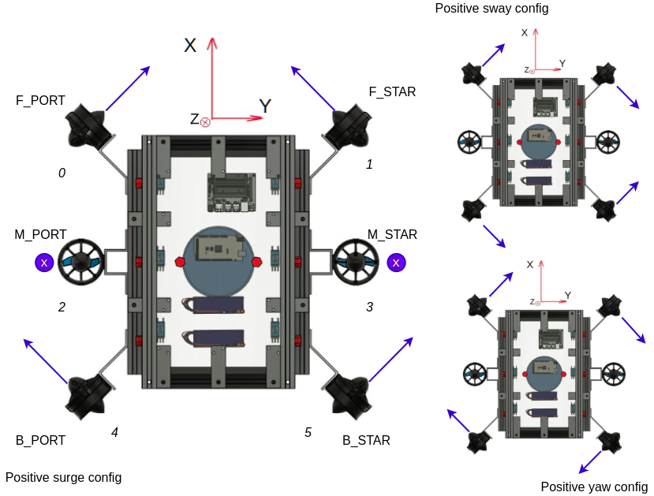
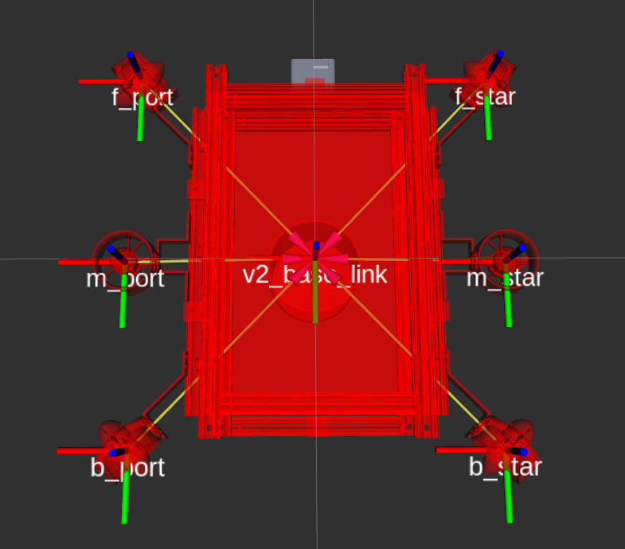

# On thruster configuration
## Introduction
The AUV_v2 vehicle is completely dependent on the thrusters for manoeuvring. Understanding the configuration of thrusters around the vehicle helps in designing systems responsible for navigation and motion planning. This page aims to provide complete information on how the AUV_v2 thrusters are configured.

## Few definitions
- **Effort**: Refers to any physical quantity that can be controlled by a system to generate motion. This quantity is generally the final output of the control system. Eg: While using thrusters, we control the force exerted by the motors by varying the PWM signal. Hence, in real-world implementation, the final output of the control system would be PWM and hence it is the final "effort". In simulation environment, we directly indicate the force that each thruster will exert. Hence, in simulation, "effort" refers to the force.

### Translation
- The **X** unit vector is parallel to the forward direction or in the direction of vehicle's heading. The motion along the *X* axis is referred to as **surge** motion. 
- The **Z** unit vector is anti-parallel to the direction of force of gravity on the vehicle or in the direction of acceleration of the vehicle towards the centre of the Earth. The motion along the **Z** axis is referred to as **heave** motion.
- The **Y** unit vector is obtained by taking cross product between **Z** and **X** unit vector (according to right-hand cartesian system). The motion along the **Y** axis is referred to as **sway** motion.
   - The positive **Y** side is also called the *starboard* (right side when facing along X).
   - The negative **Y** side is also called the *port* (left side when facing along X).

### Rotation
- Rotation about **X** axis: Roll
- Rotation about **Y** axis: Pitch
- Rotation about **Z** axis: Yaw

## AUV_v2 Thruster Configuration


The thruster names that the image introduces are used within the code to develop the control strategy. Everyone is advised to use these names even during normal discussions about thruster within the Society. The number associated with each of the thruster refers to the index of the thruster within various arrays used in the code. The purple colored arrows shows the direction of the force exerted by a particular thruster. 

> **By default, the thrusters are expected to exert force in the direction indicated for the positive surge configuration.** This choice is merely a euphemism for the vehicle to *go ahead* and *dive deeper*.

### Thruster effort mapping
This subsection highlights the difference in the axes convention used in the simulation and real world. The following is a screenshot of the vehicle in RViz


Gazebo and RViz use the coordinate system shown by the RGB colored axes (R->X, G->Y, B->Z). The direction in which each of the thruster exerts force is coded in the `auv_v2.xacro` file according to the Gazebo convention that is different from the real world convention. Nevertheless, the positive surge configuration of thrust directions is chosen in this case also. Hence, the developer need not worry about the convention changes and can go ahead developing algorithms considering the real-world convention only.

## Traversing
The following table summarizes which thrusters are responsible for which degree of freedom:
| Degree of Freedom | Thruster Name |
| --- | --- |
| Heave, Roll *(HR)* | `M_PORT`, `M_PORT` |
| Surge, Yaw, Sway *(SYS)* | `F_PORT`, `F_STAR`, `B_PORT`, `B_STAR` |
> The four thrusters responsible for performing SYS are called **vectored thrusters**. 

### Performing HR
This is the most straight forward implementation: (+, - indicate direction of thrust)
| | `M_PORT` | `M_STAR` |
| --- | --- | --- |
| Roll+ | - | + | 
| Roll- | + | - |
| Heave+ | + | + |
| Heave- | - | - |

## Vectored Thrust Fusion (Performing SYS)
This [image](#auv_v2-thruster-configuration) shows how the vectored thrusters must exert thrust to achieve surge, yaw, or sway. But in actual implementation, surge/sway must be performed while maintaining the heading (yaw angle) or to traverse diagonally, surge and sway must be performed together. In order to achieve these wide variety of motion using the vectored thrusters, a basic fusion technique is used.

### The VTF
1. List down the direction in which thrust must be exerted by each of the vectored thrusters (+1 for positive and -1 for negative) for positive surge, yaw, and sway:

| | `F_PORT` | `F_STAR` | `B_PORT` | `B_STAR` |
| ---  | --- | --- | --- | --- |
| **Surge** | 1 | 1 | 1 | 1 |
| **Yaw** | 1 | -1 | 1 | -1 |
| **Sway** | 1 | -1 | -1 | 1 |

The above matrix is called **SYS matrix**.

2. The output of the PID controller (if it exists) for any of the SYS motion is assumed to be the total effort the vehicle must put to achieve a set-point for that particular motion. If no PID controller exists, manual effort can be calculated using the remote controller. This means, there are in total 3 different effort values.
3. All these three values are then linearly combined using 3 constants (weights) as follows:

```
th[i] = a*sys_mat[0][i]*surge_effort + b*sys_mat[1][i]*yaw_effort + c*sys_mat[2][i]*sway_effort
``` 
where, `a + b + c = 1`. But how to choose the weights?

4. We define *beta* as the weight for the yaw effort and *(1 - beta)/2* is weight for the surge and sway effort.
    - Yaw effort must get more weightage because it is, in general, acceptable that heading remains constant while surging and/or swaying. This means *beta > 0.333*. If the motion requirement is not inline with the general assumption, then the developer may choose an arbitrary value for *beta*.
    - Surge and sway get equal weightage because achieving diagonal motion becomes more intuitive.
    - The recommended value for *beta* is **0.4**. This is because, *(1 - beta)/2 = 0.3*. Hence, by choosing *beta = 0.4*, yaw efforts gets more weightage as per the requirement, and since the difference between the weights is also not too large, equity is achieved.

[Back to Home](./Home.md)