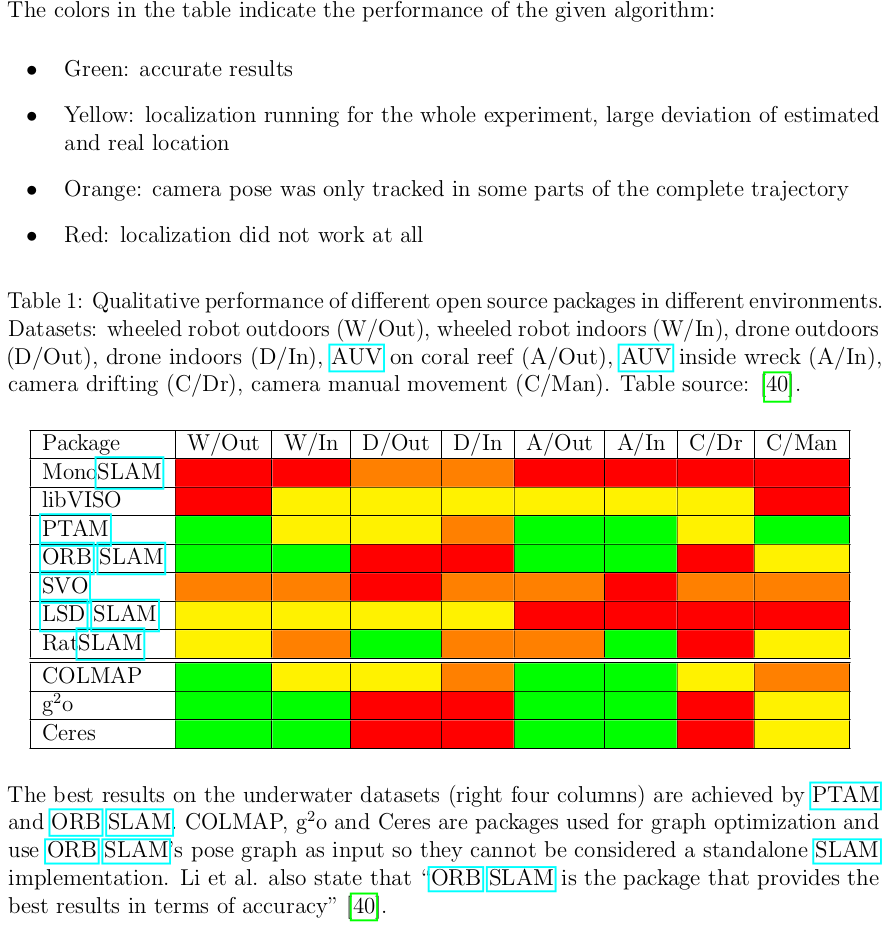

# Underwater SLAM scenario
> SLAM in underwater scenario is still considered as "an unsolved problem in robotics"
### Key points from [here](https://robotics.ee.uwa.edu.au/theses/2017-UnderwaterSLAM-Kahlefendt.pdf):
- Using a non-filtering SLAM approach with a monocular camera setup in a underwater environment has only been tested in few works so far.
- Qualitative comparision of SLAM algorithms

- Challenges:
  - **Monotony**: In many locations the sea floor consists mainly of sand and does not offer many recognizable structures which could be used for extracting landmarks. This may cause some SLAM algorithms to fail.
  - **Turbidity**: Seawater generally has a lot of different particles in it that can cause trouble when using cameras. Feature-based approaches might falsely detect particles as features which can have strong effects on the algorithm’s accuracy.
  - **Dynamics**: Water tends to be highly dynamic so even if the robot is not actively trying to move, it is still subject to currents and water movement. Many SLAM algorithms rely on a kinematic model estimate the current pose which needs to take the water dynamics into account.
  - **Loss of colours**: Due to the effect that water absorbs different wavelengths of light at different depths the visual appearance of the environment quickly becomes monotonous. Color gradients can be a valuable information source which might not be available underwater.
  - **Lighting**: Not only does water absorb light, any movement of the water surface will also cause the light to scatter. This leads to dynamic shapes on the ground which make it difficult for an algorithm to detect static landmarks.
  - **Sensors**: On land, devices can make use of GPS for localization. Underwater GPS does not work. Instead robots have to either rely on internal sensors like cameras, sonar, and IMUs or on acoustic positioning systems which are expensive and limited to the region they are installed in.
  - **Communication**: Signals used by common communication measures like Wireless Local Area Network (WLAN) or radio do not travel well in water. A common way to communicate is to use acoustic transmission. The problem with these techniques is that they can have high latency and a low data transfer rate.
  - **Processing**: Due to size, cooling and cost constraints Autonomous Underwater Vehicles (AUVs) are mostly equipped with very little processing power and often rely on hardware like Raspberry Pis.
- Criteria decided to select an algorithm:
  - Non filtering
  - Works only with camera, potentially integrates IMU
  - Runs on a CPU
  - Creates and records a map
  - Is open source
- ORB SLAM is selected in the end
- Note that in the thesis that was referred to, had the ROV was connected to the laptop and then the implementation was done. The ORB SLAM algorithm ran on the laptop and there was not any onboard CPU to perform this task.

### Further reading
- [Underwater SLAM: Challenges, state of the art, algorithms and a new biologically-inspired approach](https://ieeexplore.ieee.org/document/6913908)

[Back to Home](./Home.md)