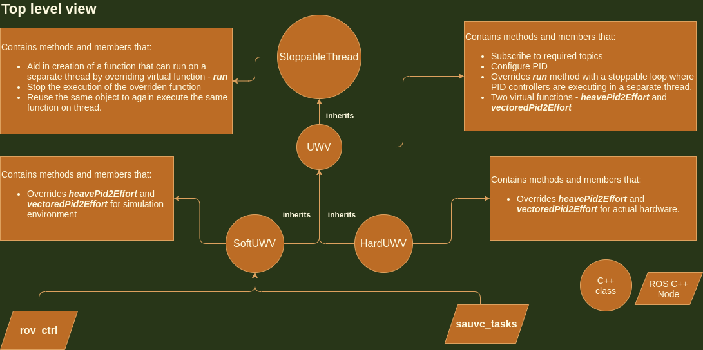

# include

Contains header files common to all the roscpp nodes.

## About files
- `config_UWV.h`: Defines basic macros responsible for configuring the vehicle's control.
- `hard_UWV.h`: Derived class of `UWV`. Overrides functions that are hardware dependent.
- `pid_rotate.h`: Implementation of PID controller for rotatory motion.
- `pid_translate.h`: Implementation of PID controller for translatory motion.
- `soft_UWV.h`: Derived class of `UWV`. Overrides functions that are simulation dependent.
- `stoppable_thread.h`: Abstract class providing API for reusable and stoppable thread.
- `terminal_getch.h`: Linux implementation of `getch` command for CLI.
- `uwv.h`: Abstract class; derived class of `StoppableThread`. Contains major functions responsbile for vehicle's motion. Houses PID controllers.

## Inheritances

[Back to inter-package navigation](../../docs/v2_control.md)

[Back to Home](../../docs/Home.md)